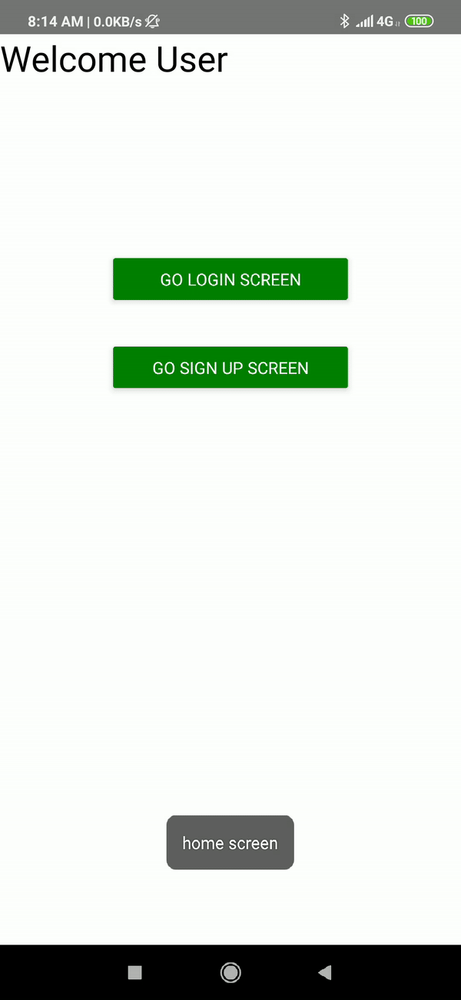

# React Native Stack Navigator Example

## Demo

## Get started

1) Clone repository 
`git clone https://github.com/MexsonFernandes/react-native-stack-navigator-example`

2) Change directory 
`cd react-native-stack-navigator-example`

3) Install dependencies 
`yarn install` 
or 
`npm install`

All set!!!

## Run App

* `react-native run-android`
* `react-native start`

